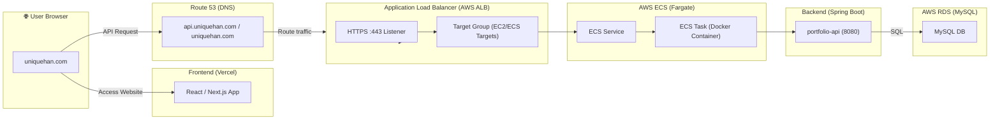

# 🌐 유일한 포트폴리오 – Frontend

> **유일한 포트폴리오 서비스입니다.**  
> Next.js 기반으로 제작되었으며, Spring 기반의 백엔드 API와 연동됩니다.

> [백엔드 API Repository](https://github.com/benedictJHGil/my-portfolio-app-back) 👈️ 클릭

<br>

## 🧩 주요 기능

- 포트폴리오 프로젝트 / 경력 / 소개 / 기술 스택 정보 제공
- API 연동 (백엔드 Spring Boot / AWS Fargate)
- 환경 변수로 API Base URL 설정 (`NEXT_PUBLIC_API_BASE_URL`)
- 이미지 최적화 및 Lazy Loading 적용
- `/wip` 경로를 통한 비공개 개발 모드 지원
- Vercel 자동 배포 (PR 기반 Preview 환경 생성)

<br>

## ✨ 핵심 포인트

- **Next.js + SSR** → 빠르게 렌더링되고 SEO 최적화
- **정적 파일 + CDN** → 전 세계 어디서나 빠른 페이지 표시
- **Vercel로 자동 배포** → 커밋하면 즉시 반영되는 DevOps 경험
- API 호출 시 **CORS / 환경분리(prod/dev)** 지원
- 전체 인프라가 백엔드 API와 분리되어 확장성과 유지보수성이 높음

<br>

## 🚀 Live Service

| URL | Description |
| --- | --- |
| https://uniquehan.com | Main portfolio frontend (Production) |
| https://www.uniquehan.com | Alias of production |

<br>

## 🛠️ Tech Stack

| Category | Tech |
|----------|------|
| Framework | **Next.js (App Router)** |
| Language | TypeScript |
| Deployment | **Vercel** |
| Styling | Tailwind CSS |
| API | Axios |
| Infra integration | API 호출 시 CORS, ENV 설정 적용 |

<br>

## 📁 Project Structure

```plaintext
/src
├─ 📁 app
│  ├─ 📁 portfolio
│  ├─ 📁 wip
│  ├─ 🎨 globals.css
│  └─ 🧩 layout.tsx
├─ 🔌 adapters
├─ 🧩 components
├─ 🪝 hooks
└─ 📦 types
```

<br>

## 🏗️ Architecture Overview

- Frontend: Vercel (Next.js)
- Backend: AWS ECS Fargate + Spring Boot
- Database: AWS RDS (PostgreSQL)
- DNS: Route 53
- SSL/TLS: AWS Certificate Manager
- Network: ALB (HTTPS 443 → ECS → RDS)

<br>



<br>

## 📦 Scripts

```sh
npm install
npm run dev
npm run build
npm start
```