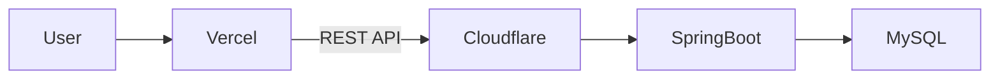

# 🌐 Portfolio Frontend

> 개인 포트폴리오 웹사이트의 프론트엔드 애플리케이션입니다.
>
> Next.js(App Router) 기반으로 제작되었으며, Spring Boot 백엔드 API와 연동하여 포트폴리오 정보를 제공합니다.
>
> 프론트엔드는 **Vercel**에서 서비스되고 있으며, 백엔드는 **Home Server + Docker** 환경에서 운영됩니다.

> 🔗 **Backend Repository**
>
> https://github.com/benedictJHGil/my-portfolio-app-back

---

# 📖 Overview

이 프로젝트는 개인 포트폴리오를 웹에서 제공하기 위한 프론트엔드 애플리케이션입니다.

사용자가 프로젝트, 경력, 기술 스택 등을 직관적으로 확인할 수 있도록 구성하였으며, 백엔드 API와 연동하여 데이터를 동적으로 제공합니다.

또한 개발 환경과 운영 환경을 분리하여 유지보수성과 확장성을 고려하였습니다.

---

# ✨ Features

- 프로젝트 및 경력 소개
- 기술 스택 정보 제공
- About 페이지 제공
- 백엔드 REST API 연동
- 환경별 API Endpoint 관리
- 이미지 최적화(Image Optimization)
- Lazy Loading 적용
- WIP(Work In Progress) 모드 지원
- 반응형 UI

---

# 🏗 Frontend Architecture

```
Browser
    │
    ▼
Next.js (App Router)
    │
    ▼
Components
    │
    ▼
API Adapter
    │
    ▼
Spring Boot API
```

### Design Principles

- App Router 기반 페이지 구성
- Component 단위로 UI 분리
- Adapter를 통한 API 호출 추상화
- 환경 변수 기반 API 주소 관리
- 재사용 가능한 컴포넌트 설계
- 개발 환경과 운영 환경 분리

---

# 🛠 Tech Stack

| Category | Technology |
|-----------|------------|
| Framework | Next.js (App Router) |
| Language | TypeScript |
| Styling | Tailwind CSS |
| Deployment | Vercel |
| Version Control | Git / GitHub |

---

# 📂 Project Structure

```text
src
├── app
│   ├── (card)
│   ├── (site)
│   │   ├── about
│   │   ├── portfolio
│   │   └── wip
│   ├── globals.css
│   ├── layout.tsx
│   └── not-found.tsx
├── adapters
├── components
├── lib
├── hooks
├── types
└── utils
```

---

# 🌐 Live Service

| URL | Description |
|------|-------------|
| https://uniquehan.com | Production |
| https://www.uniquehan.com | Alias Domain |

---

# ⚙ Environment Variables

```env
NEXT_PUBLIC_API_BASE_URL=
NEXT_PUBLIC_WIP=
```

환경에 따라 API Endpoint와 WIP 모드를 분리하여 관리합니다.

---

# 🚀 Local Development

```bash
npm install

npm run dev
```

Production Build

```bash
npm run build

npm start
```

---

# 🚀 Deployment

현재 서비스는 다음과 같은 구조로 운영됩니다.

### Production Environment

- Frontend : Vercel
- Backend : Home Server (Docker)
- API Tunnel : Cloudflare Tunnel


```mermaid
flowchart LR

User --> Vercel
Vercel -->|REST API| Cloudflare
Cloudflare --> SpringBoot
SpringBoot --> MySQL
```

---

# 📜 Infrastructure History

프로젝트 운영 과정에서 인프라를 개선하였습니다.

| Version | Infrastructure |
|----------|----------------|
| v1 | Frontend(Vercel) + Backend(AWS ECS Fargate + RDS + ALB + Route53 + Terraform) |
| Current | Frontend(Vercel) + Backend(Home Server + Docker + Cloudflare Tunnel) |

AWS 기반 클라우드 환경에서 직접 서비스를 구축하고 운영한 이후, 서비스 규모와 운영 비용을 고려하여 Home Server 기반 인프라로 이전하였습니다.

이를 통해 개발 환경은 유지하면서 운영 비용을 절감하고 인프라를 직접 관리하는 경험을 쌓았습니다.

---

# 💡 Key Highlights

- Next.js App Router 기반 개발
- TypeScript 적용
- 컴포넌트 기반 UI 설계
- REST API 연동
- 환경별 설정 분리
- 이미지 최적화
- Vercel 배포 경험
- AWS 및 Home Server 환경 모두 운영 경험

---

# 🔮 Future Improvements

- 다국어(i18n) 지원
- 다크 모드 지원
- Lighthouse 성능 최적화
- PWA 적용
- 사용자 인터랙션 애니메이션 개선
- 접근성(Accessibility) 고도화

---

# 🔗 Related Repositories

| Repository | Description |
|------------|-------------|
| Frontend | https://github.com/benedictJHGil/my-portfolio-app-front |
| Backend | https://github.com/benedictJHGil/my-portfolio-app-back |